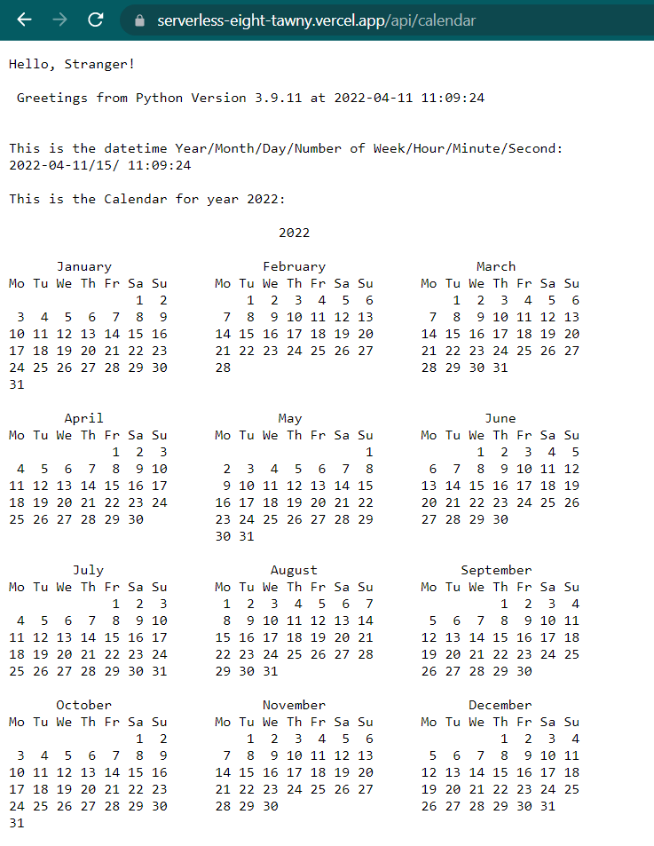
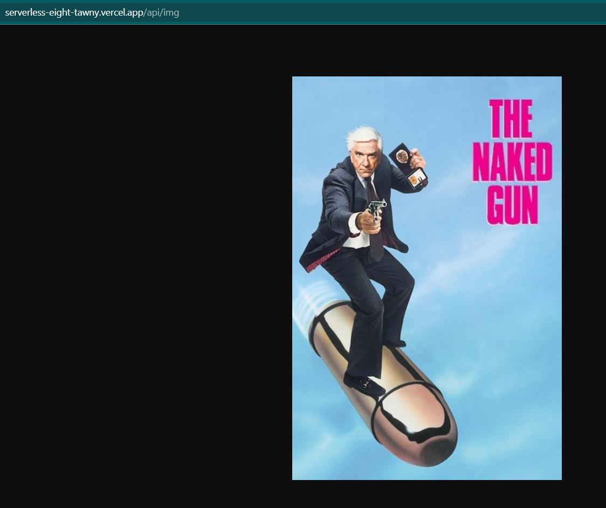
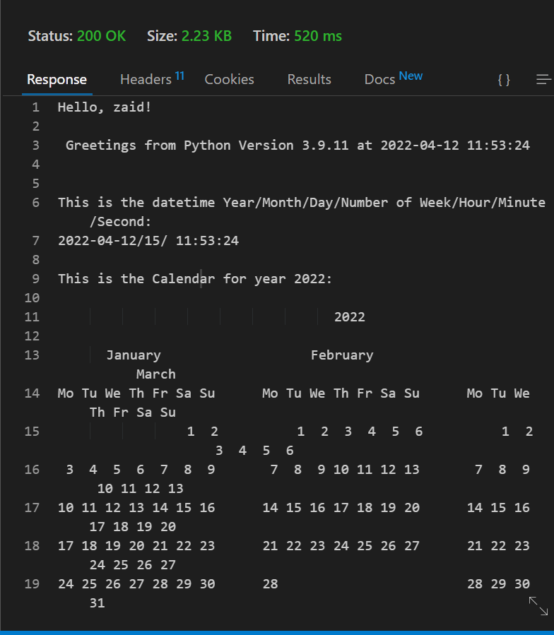

## To see the calendar of year 2022:
- First click on this [url](https://serverless-eight-tawny.vercel.app)
- Then type **/api/calendar** at the end of the url path
- You will see the calendar of this year, plus the datetime and week number/month.
- type in a query in the url path  **?name=yourname** to get see the Hello **your name**
  E.g. https://serverless-eight-tawny.vercel.app/api/calendar?name=zaid
  
- As can be seen in the picture below: 

## Note: This is just an image of a funny movie

- First click on this [url](https://serverless-eight-tawny.vercel.app)
- Then type **/api/img** at the end of the url path
- You will see the a picture of a great comedy movie.

## Testing using Thunder Client or Postman
- Use this **URL** (https://serverless-eight-tawny.vercel.app/api/calendar)
- Make sure its a **Get** request 
- Select the **Query** section
- type in **name** in the parameter field and **your name** in the value field
- Press send and you will see like the following result:

